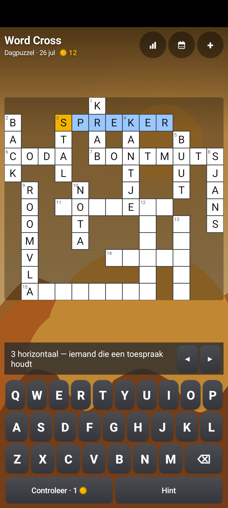
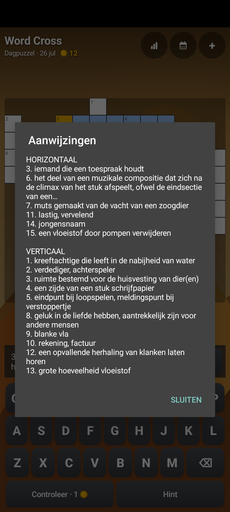

# 🧩 Word Cross / Woord Puzzel

**A tiny, native Android crossword game** — pure Kotlin, no ads, no trackers, ~95&nbsp;KB. Every
puzzle is a generated interlocking ("Zweedse") crossword, and every clue is a real dictionary
definition with the answer masked out. One daily puzzle for everyone — with a daily leaderboard to
put your time on — plus free play in three sizes and a fourth you can earn. **The words, the
definitions and the interface are Dutch.**

  
  &nbsp;&nbsp;
  

## ▶️ Play it in your browser

**<https://abons.github.io/wordpuzzle/>** — the same game as a web app: the same word data, the
same daily puzzle and the same leaderboard, installable as a PWA. Nothing to download.

## Where to get the Android app

**Word Cross is moving to Google Play, and there is no download here.** The APKs that used to hang on
the [releases](https://github.com/abons/wordpuzzle/releases) were taken down on 2026-08-16, and the
shared landing page (<https://abons.github.io/wordguesser/>) no longer serves one either. The
F-Droid repository that once carried these games was retired on 2026-08-07. Until the Play listing
is live there is no way to install the game for the first time.

If you already have it, keep it — it works offline once the word list is cached, and nothing about it
expires. One thing to know about the move: the Play version will be signed by Google rather than by
this app's own key (SHA-256
`24:05:A1:0D:35:24:40:37:9A:88:91:82:9F:02:BE:7C:B1:26:D1:55:6C:D7:33:92:93:8B:A9:FE:A2:AD:D8:CA`),
so it will **not** install over what you have. Getting the Play version later means removing this one
first, and a puzzle in progress does not survive that.

The [release notes](https://github.com/abons/wordpuzzle/releases) stay as the record of what changed
per version, up to the newest one, 1.6. The notes only — the files that hung under them are gone.

## What it is

- 🧩 **A generated interlocking crossword.** Words cross each other in a freeform grid — numbered,
  cropped to what is actually used, and different every time.
- 📖 **The clues are dictionary definitions.** Every answer is a Dutch word, and its clue is that
  word's own definition with the answer masked out, so a puzzle teaches as much as it tests. What is
  left has to be a question: a clue that keeps fewer than two content words once masked is never
  asked — *"iemand die iets …"* is not solvable — and the `~` that Wiktionary writes where its own
  headword belongs reads as `…`, the same gap as the answer we mask ourselves.
- 📅 **A daily puzzle.** One fixed grid per day, the same for everyone, derived from the date — so
  it is reproducible across launches and comparable with anyone else playing that day. The day comes
  off your phone, so a day *earlier* than the latest this install has seen still plays but does not
  count: no coins, no streak, no place on that day's board. Travelling west costs you nothing but a
  single payout.
- 📐 **Three sizes in free play:** klein (±8 words), normaal (±16) and groot (±24). The daily
  ignores the choice on purpose: it has to be the same challenge for everybody.
- ⌨️ **Typing that carries on.** After Controleer every correct letter is locked, the cursor moves
  into the next open word by itself, and arrows on the clue bar step past the words already full.
- 💾 **Your grid survives closing the app.** The daily and free play each keep their own board,
  locked letters included.
- 🏆 **A daily leaderboard.** Finish the daily and you may put a name on the board for that day,
  ranked on corrected time: the clock, plus 30 seconds for every wrong letter Controleer found and
  60 for every hint. So help is a trade rather than a disqualification — one hint still beats being
  five minutes slower. The board shows the day's fastest 200, cut server-side, so a crowded day is
  still one quick dialog. Sending your name is a choice; solving alone never sends anything.
- 🪙 **Coins, earned by playing and spent on help.** Solving pays — 3 for the daily, 1 for a free
  puzzle, 1 more without a hint — and Controleer pays a coin back for every word it newly confirms,
  so being right costs nothing and guessing does. You start with 5, and at zero coins Controleer is
  free: it still marks and still locks, it only stops paying — an empty wallet never leaves you
  playing without a signal. Help has a price: 1 coin to check, 1 for a letter, 3 for a whole word,
  30 to unlock the **extra-large puzzle** (±36 words, 19 columns) for good, and 10 to put a broken
  day streak back. **There is nothing to buy and no billing code in this APK** — coins come out of
  play only.
- ✅ **Controleer and Hint.** Check marks wrong letters red and locks the right ones; the hint menu
  reveals a single letter or the whole word — in the daily too, where it costs rank instead of being
  refused. The statistics count solving without hints separately.
- 📊 **Statistics and streaks:** solved, solved without hints, dailies, current and best day streak.
- 🏞️ **Eight drawn backdrops** — mountains, ocean, forest, desert, city, night, meadow, autumn —
  built entirely from canvas shapes, so there is not a single image file in the APK.
- 🔊 **Usable with a screen reader.** The grid is one hand-drawn canvas, so it is published as a
  virtual view tree: every open cell is its own focusable node that says where it is, what is in it
  and which clues run through it. Walked through with TalkBack by ear, not just checked in a dump.
- ✈️ **Offline after the first start.** The word list is downloaded once and cached; after that the
  app never needs the network again.

## Why so small?

It is written in **pure Kotlin on the Android framework only** — no AppCompat, Compose, Material or
third-party runtime libraries, and the whole UI is built in code. The daily leaderboard talks to its
database over plain HTTPS, without an SDK. Result: a ~95&nbsp;KB APK that runs on Android 5.0+.

## Privacy

No ads, no analytics, no accounts, no third-party library in the build. The APK asks for INTERNET
and ACCESS_NETWORK_STATE, and they are there for two things: downloading the Dutch word list and its
definitions on first start, and the daily leaderboard.

The leaderboard is the only thing this app ever uploads, and only when you ask it to. What goes up is
what you type as a name plus three numbers from that puzzle — your time, how many wrong letters
Controleer found and how many hints you used — filed under the day you solved. Type whatever name you
like; it is a label on a public list, not an account. Solving without submitting sends nothing at all,
and everything else — your puzzles, statistics and streaks — never leaves the device.

## Word data

The answers and their definitions come from the Dutch Wiktionary (CC BY-SA 3.0), with a small number
of gap fills released as CC0. They are prepared into a word list that is hosted alongside the sibling
games; provenance and licences per file are listed in
[SOURCES.md](https://abons.github.io/wordguesser/wordlists/SOURCES.md).

## Support

If you enjoy it, you can [☕ support the developer on Ko-fi](https://ko-fi.com/hrbons).

---

*This repository is the public page for Word Cross and serves its web version over GitHub Pages.
The source is kept in a private repository, and the Android app is distributed through Google
Play — no APK is published here.*
